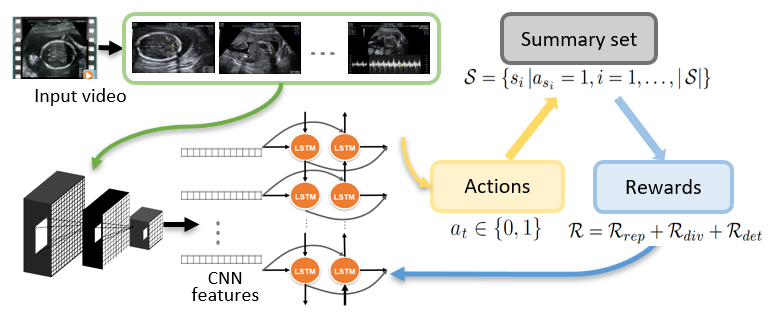

# Introduction

This repo contains the Pytorch implementation of the MICCAI'20 paper - "Ultrasound Video Summarization using Deep Reinforcement Learning" [pdf](https://arxiv.org/abs/2005.09531v1).

We introduce a novel fully automatic video summarization method that is tailored to the needs of medical video data.  
Our approach is framed as reinforcement learning problem and produces agents focusing on the preservation of important diagnostic information.  

# Setup

**Environment:** 
* PyTorch 0.4
* python 2.7
* numpy 1.15.1
* h5py 2.7.0
* matplotlib 2.0.2

**Pre-trained models:** 
The code utilize pre-trained sonoNet models for standard plane detection. More details for this model can be found here: 
The default path for pre-trained networks is [sononet](https://arxiv.org/abs/1612.05601).  

**Dataset:**
The features extracted from the ultrasound videos can be downloaded [HERE](https://imperiallondon-my.sharepoint.com/:f:/g/personal/trl15_ic_ac_uk/EoX1nQHhB3FJnbAzarOLwPgBbfU89iCXwnJaxg6rwteR_g?e=fcTrC3). 
The raw ultrasound dataset is not public subject to approval by the project ethics board and under a formal Data Sharing Agreement between the collaboration institutaions, the hospital and the participants.

# Demo Videos
Example video summaries from an untrasound examination:
1) reducing the video to 15% of it’s original length: [demo1](https://youtu.be/K3kC2LEB0fY), 
2) unsupervised to 15% length: [demo2](https://youtu.be/72iP9F3XxMA) 
3) to a more relaxed 45% of the original length: [demo3](https://youtu.be/6LRs78hzRUs).

# Citation

@misc{liu2020ultrasound,

    title={Ultrasound Video Summarization using Deep Reinforcement Learning},
    author={Tianrui Liu and Qingjie Meng and Athanasios Vlontzos and Jeremy Tan and Daniel Rueckert and Bernhard Kainz},
    year={2020}, 
    eprint={2005.09531},
    archivePrefix={arXiv},
    primaryClass={cs.CV}
}

# Reference
This repo is implemented based on the the project https://github.com/Lorna-Liu/pytorch-vsumm-RL.
